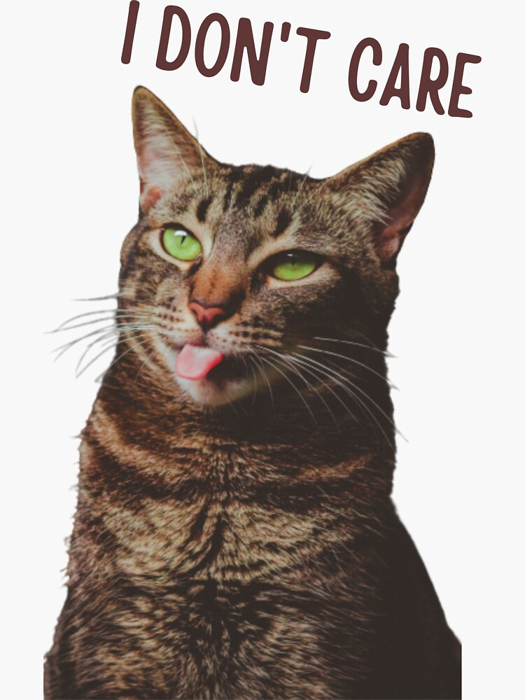
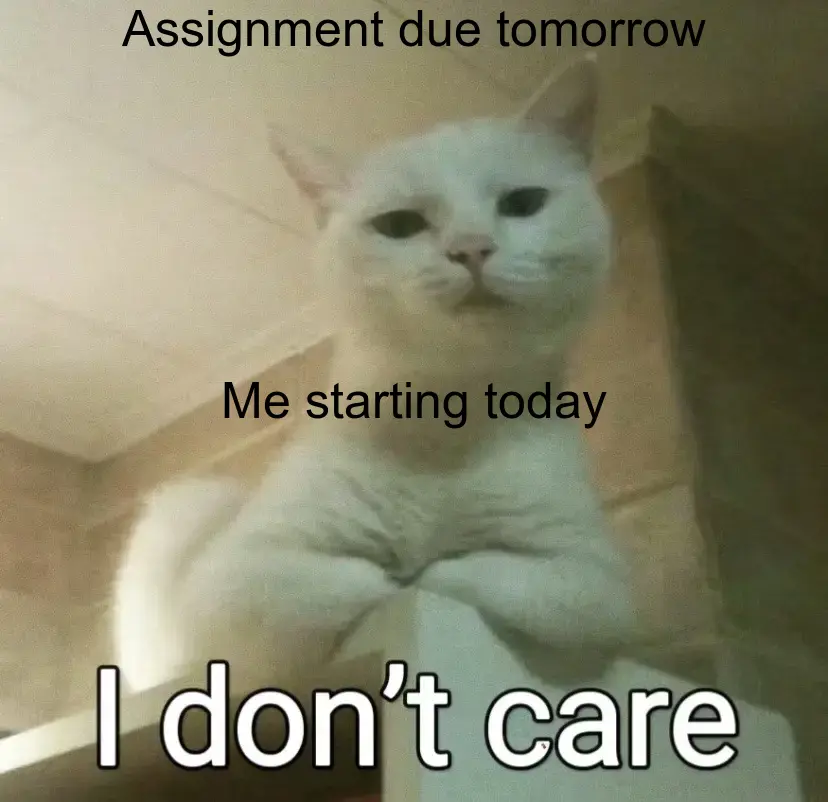
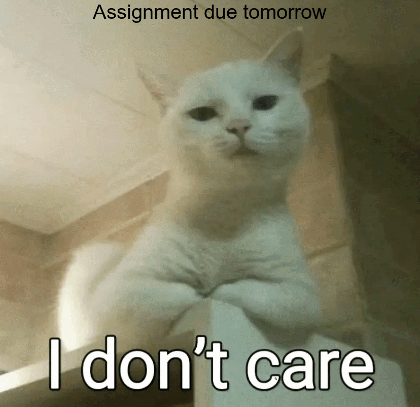

```{r setup, include=FALSE}
knitr::opts_chunk$set(echo=TRUE, message=FALSE, warning=FALSE, error=FALSE)
```

```{css}
body {
  background-color: #f5f5f5;
}

h2 {
  color: darkblue;
}

p {
  font-size: 16px;
}

```

## Project requirements


[My GitHub repo](https://github.com/YOUR_USERNAME/stats220)

## Inspo meme


## My meme


I changed the text to reflect my experience of starting assignments late. 
The original meme inspired the layout, but I adapted the message to fit my situation.

## My animated meme 



## Creativity
  I think my meme might not have made any technical breakthroughs compared to the examples in the lab. It's not much different. However, during the process of making the meme, I added more background text to show a funny little cat that started its homework too late. It's not meant to be disrespectful to the teacher.  Tianyi Zhou apologizes here.

## Learning reflection
I think the most important concept I learned from Module One is how to edit and create memes using R. This experience was quite interesting and helped me become more familiar with basic R functions and image processing techniques. It also gave me a better understanding of how programming can be applied in creative ways. However, I am more interested in data cleaning and generating future data predictions in the field of data technology. I believe these skills are more relevant to my academic goals and future career in data science. Although I am not sure when I will start learning these more advanced topics, I am looking forward to exploring them in upcoming modules and developing a deeper understanding of data analysis and predictive modeling.


## Appendix

<mark>Do not change, edit, or remove the `R` chunk included below.</mark> 

If you are working within RStudio and within your Project1 RStudio project (check the top right-hand corner says "Project1"), then the code from the `meme.R` script will be displayed below.

This code needs to be visible for your project to be marked appropriately, as some of the criteria are based on this code being submitted.


```{r file='meme.R', eval=FALSE, echo=TRUE}

```

